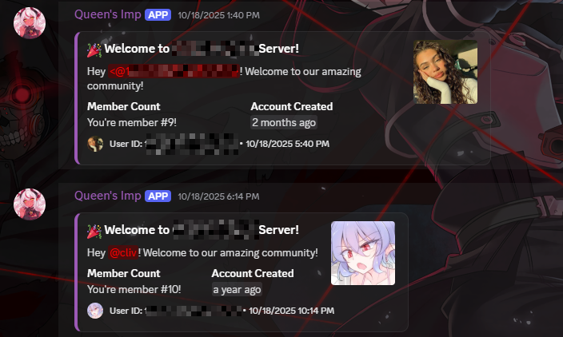
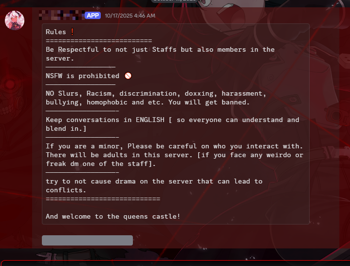
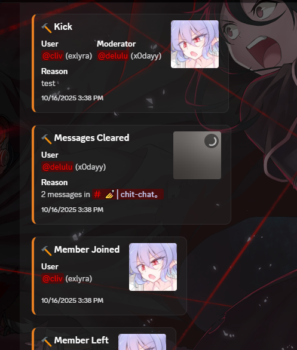

# 🌙 QueenIMP-Bot — A Modern Discord Experience

QueenIMP-Bot is a **feature-packed Discord bot** built with **Python** and **SQL**, designed for moderation, entertainment, and customization.  
This repository serves as a **showcase** of the project — no source code is shared publicly.

---

## ✨ Features

- 🛡️ **Advanced Moderation** — Timeout, Warn, Ban, Kick, Clear, lock, Kiss/Hug Game. with custom embeds.   
- ⚙️ **Custom Configuration** — Guild-specific settings saved in an SQL database.  
- 🎨 **Beautiful Embed System** — Sleek modern UI with Cozy-styled colors.

---

## 🖼️ Screenshots

|  |  |  |
|:------------------------------------:|:------------------------------------:|:------------------------------------:|
| Welcome & Auto-Role | Normal-Send | Logs-Chat |

---

## 🧠 Built With

- 🐍 **Python** — Core logic & commands.  
- 🗃️ **SQLite / SQLAlchemy** — Persistent data storage.  
- 🤖 **Discord.py / Nextcord** — Powerful Discord API wrapper.  

---

## 🔒 Source Code

This is a **closed-source project**.  
If you’d like to see more, request access or contact me below.

---

## 📬 Contact

- **Developer:** [x0dayy]
- **Discord Contact:** [https://discord.com/users/1412418496733773855]
- **Email:** [panicyuzu@proton.me]
- **Portfolio:** [https://x0dayy.pages.dev/]

---

## 🏷️ License

This project is **not open source**.  
You may not redistribute or modify any part of this repository without permission.

